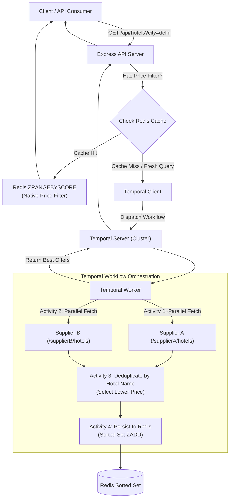

# Hotel Offer Orchestrator

A distributed hotel offer orchestration service built with **Node.js (TypeScript)**, **Express**, **Temporal.io**, **Redis**, and **Docker Compose**.

It aggregates hotel offers across multiple suppliers in parallel, deduplicates by hotel name selecting the lowest rate, caches results in Redis, and enables native Redis price range filtering.

---

## Architecture Overview



---

## Tech Stack

- **Runtime & Language**: Node.js v20+ with TypeScript (ESM)
- **Web Framework**: Express 5
- **Workflow Orchestration**: Temporal.io (`@temporalio/client`, `@temporalio/worker`, `@temporalio/workflow`, `@temporalio/activity`)
- **Caching & Filtering**: Redis (via `ioredis`) using Sorted Sets (`ZSET` + `ZRANGEBYSCORE`)
- **Containerization**: Docker & Docker Compose (Multi-stage build)

---

## Features

1. **Parallel Supplier Integration**: Concurrently calls `/supplierA/hotels` and `/supplierB/hotels`.
2. **Lowest Price Deduplication**:
   - Matches hotels by normalized name.
   - For overlapping hotels, selects the supplier offering the cheaper rate.
   - If only one supplier offers the hotel, includes it directly.
3. **Redis Native Price Filtering**:
   - Saves deduplicated results into a Redis Sorted Set (`hotels:city:<city>`).
   - Executes price range queries directly in Redis using `ZRANGEBYSCORE`.
4. **Health Check (`/health`)**:
   - Inspects status and latency of Supplier A, Supplier B, and Redis.
5. **Resilient Execution**:
   - Automatic activity retries and timeouts managed by Temporal.
   - Graceful fallback capability for standalone local development.

---

## API Endpoints

### 1. Main Orchestration & Price Filtering
`GET /api/hotels?city=delhi`  
`GET /api/hotels?city=delhi&minPrice=5000&maxPrice=6000`

#### Query Parameters:
| Param | Type | Required | Description |
|---|---|---|---|
| `city` | `string` | **Yes** | City to search hotels for (e.g. `delhi`, `mumbai`) |
| `minPrice` | `number` | No | Minimum price filter (executed via Redis `ZRANGEBYSCORE`) |
| `maxPrice` | `number` | No | Maximum price filter (executed via Redis `ZRANGEBYSCORE`) |

#### Sample Response:
```json
[
  {
    "name": "Holtin",
    "price": 5340,
    "supplier": "Supplier B",
    "commissionPct": 20
  },
  {
    "name": "Radison",
    "price": 5900,
    "supplier": "Supplier A",
    "commissionPct": 13
  },
  {
    "name": "Marriott Aerocity",
    "price": 8500,
    "supplier": "Supplier A",
    "commissionPct": 12
  },
  {
    "name": "Leela Palace",
    "price": 9200,
    "supplier": "Supplier B",
    "commissionPct": 16
  }
]
```

---

### 2. Mock Supplier Endpoints
- `GET /supplierA/hotels?city=delhi`
- `GET /supplierB/hotels?city=delhi`
- `GET /supplierA/hotels?simulateDown=true` *(Chaos testing)*

### 3. Health Check
`GET /health`

#### Sample Response:
```json
{
  "status": "HEALTHY",
  "timestamp": "2026-09-09T04:20:00.000Z",
  "services": {
    "supplierA": { "status": "UP", "latencyMs": 2 },
    "supplierB": { "status": "UP", "latencyMs": 2 },
    "redis": { "status": "UP", "latencyMs": 1 }
  }
}
```

---

## Quick Start (Docker Compose)

The easiest way to run the full stack (API, Temporal Worker, Temporal Server, and Redis) is with Docker Compose:

```bash
# 1. Clone repository
git clone <repository_url>
cd tripare_assignment

# 2. Build and start all services
docker compose up --build
```

Services started:
- **API Server**: `http://localhost:3000`
- **Temporal Web UI**: `http://localhost:8233`
- **Redis Server**: `localhost:6379`
- **Temporal Server gRPC**: `localhost:7233`

---

## Local Development (Without Docker)

### Prerequisites:
- Node.js >= 20
- Redis (optional, runs in fallback mode if offline)
- Temporal CLI (`temporal server start-dev`, optional)

### Steps:
```bash
# 1. Install dependencies
npm install

# 2. Build TypeScript
npm run build

# 3. Start development server
npm run dev

# 4. Start Temporal Worker (in another terminal)
npm run worker
```

---

## Postman Collection

Import `hotel_offer_orchestrator.postman_collection.json` into Postman to test:
1. `Orchestrate Offers - Valid City (Delhi)`
2. `Filter by Price Range (Redis ZRANGEBYSCORE)`
3. `Orchestrate Offers - No Results (Unknown City)`
4. `Health Check (Bonus)`
5. `Mock Supplier A`
6. `Mock Supplier B`
7. `Simulate Supplier Down`
